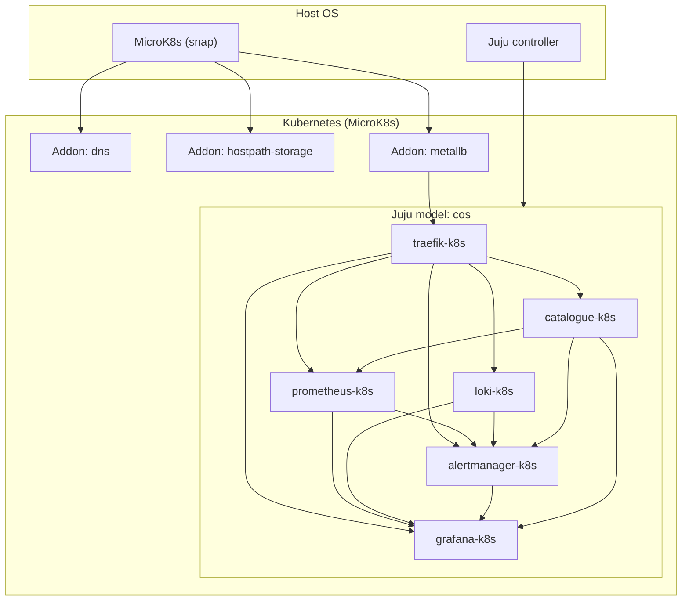

# Mimari: MicroK8s, Juju ve COS Lite

Bu belge, **MicroK8s** üzerinde çalışan bir **Juju** denetleyicisi ve **COS Lite** yığınının mantıksal iletişimini özetler. Kaynak: [Getting started with COS Lite on MicroK8s](https://documentation.ubuntu.com/observability/track-2/tutorial/installation/cos-lite-microk8s-sandbox/) ve bundle ilişki tablosu.

## Katman özeti

## Rol dağılımı

| Bileşen | Charm adı | Rol |
|---------|------------|-----|
| Giriş / ters vekil | `traefik-k8s` | HTTP(S) girişi; Grafana için `traefik-route`, diğerleri için `ingress` / `ingress-per-unit` |
| Metrik | `prometheus-k8s` | Scraping, Alertmanager ve Grafana veri kaynakları |
| Log | `loki-k8s` | Log aggregation; Grafana panoları ve kaynakları |
| Uyarı | `alertmanager-k8s` | Prometheus ve Loki uyarı yönlendirmesi |
| Pano | `grafana-k8s` | Dashboard ve datasource tüketimi |
| Dizin | `catalogue-k8s` | COS arayüzlerine bağlantı listesi |

## Juju’nun rolü (OLM)

**Juju**, charm’ların yaşam döngüsünü ve **integration** (relation) sözleşmelerini yönetir; Kubernetes’te Pod/Service üretimi charm mantığı ve `juju` modeli üzerinden ilerler. Bu, Kubernetes-native OLM’den farklı olarak **aynı modelin** farklı altyapılarda (K8s, makine, bulut) tekrar kullanılabilmesine odaklanır ([Universal operators](https://juju.is/universal-operators)).

## Ağ ve depolama (MicroK8s sandbox)

- **MetalLB**: Traefik `LoadBalancer` hizmeti için dış erişilebilir VIP veya düğüm IP aralığı.
- **hostpath-storage**: POC için PVC; üretimde [depolama en iyi uygulamaları](https://documentation.ubuntu.com/observability/reference/best-practices/storage/) ve gerektiğinde Ceph/MicroCeph değerlendirilir.

## İlişki arayüzleri (özet)

Bundle durumunda tipik uçlar (tam liste için `juju status --relations`):

- **Grafana veri kaynağı / pano**: `grafana-source`, `grafana-dashboard` (ör. `prometheus-k8s`, `loki-k8s`, `alertmanager-k8s` → `grafana-k8s`).
- **Prometheus scrape**: `metrics-endpoint` (ör. Grafana, Loki, Traefik, Alertmanager self-metrics).
- **Traefik**: `traefik-route` (Grafana), `ingress` / `ingress-per-unit` (Catalogue, Alertmanager, Prometheus, Loki birimleri).

Detaylı matris: [Integration Matrix](https://documentation.ubuntu.com/observability/reference/integration-matrix/) ve [COS Lite model topology](https://documentation.ubuntu.com/observability/reference/cos-lite-model-topology/).

## Okuma sırası

1. `documantations/PROJECT_ROOT.md` — fazlar ve vizyon  
2. `documantations/IMPLEMENTATION_PLAN.md` — Codex/operasyon için uygulama planı  
3. `skills/microk8s-*` ve `skills/juju-*` — sıra ve komut kuralları  
4. `skills/cos-*` — bileşen ve ilişki odaklı kurallar  
