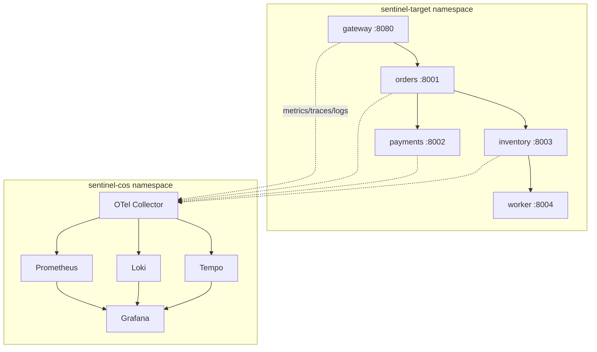
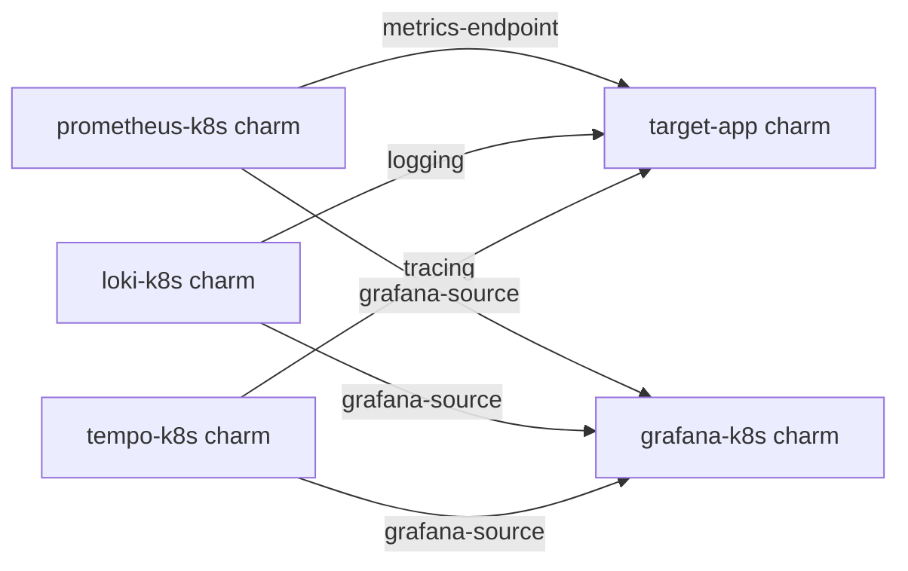
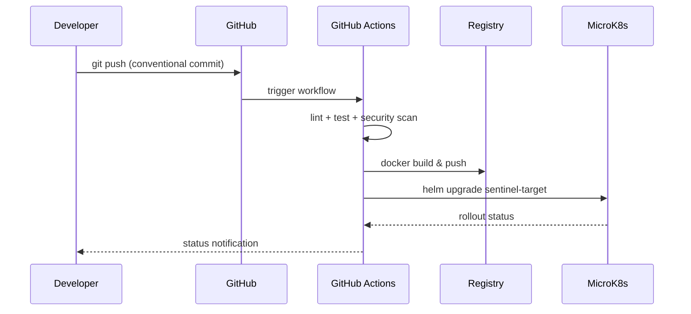
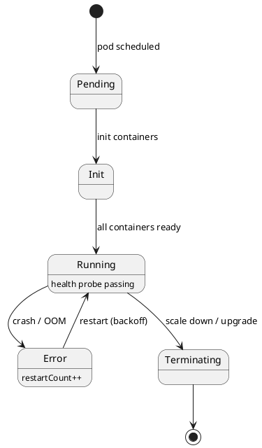
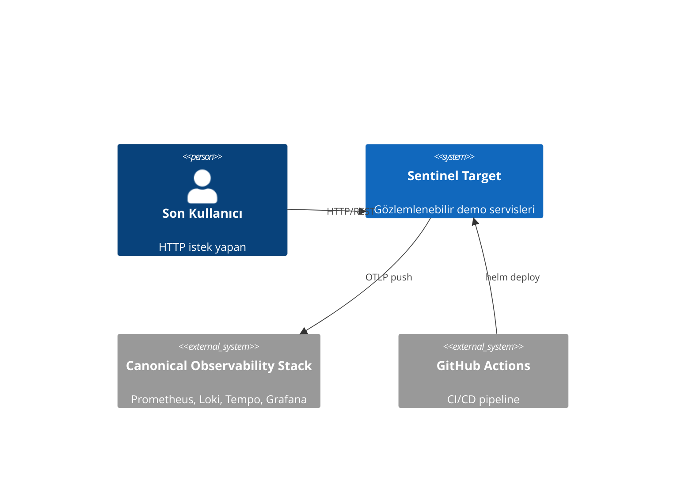

## Purpose
PNG/Visio diyagramları zamanla stale kalır ve diff'lenemez. Bu skill, Sentinel'in COS altyapısını, servis topolojisini ve deployment akışlarını Mermaid veya PlantUML sözdizimi ile kodda yönetilecek şekilde tanımlar. GitHub ve MkDocs otomatik render eder.

## Workflow

### 1. Sentinel servis topolojisi (Mermaid)


### 2. Juju relation diyagramı


### 3. CI/CD pipeline sequence diyagramı


### 4. Deployment state machine (PlantUML)


### 5. MkDocs entegrasyonu
```yaml
# mkdocs.yml
plugins:
  - mermaid2:
      version: 10.6.1
markdown_extensions:
  - pymdownx.superfences:
      custom_fences:
        - name: mermaid
          class: mermaid
          format: !!python/name:pymdownx.superfences.fence_code_format
```

### 6. C4 modeli ile mimari katmanları


## Common mistakes
1. Mermaid node isimlerinde özel karakter kullanmak — `[orders-service]` yerine `[orders]` kullan, tire sorun çıkarır.
2. Çok fazla detay tek diyagrama sıkıştırmak — C4 katmanlarını kullan, her katman ayrı diyagram.
3. Diyagramları `docs/images/` altına PNG olarak commit etmek — kaynak `.md` dosyasında Mermaid bloğu olarak sakla.
4. PlantUML için lokal server gerektiren setup kurmak — `plantuml.com` public server veya GitHub Action ile render.

## References
- `skills/docs-adr-workflow`
- `skills/target-app-service-topology`
- `skills/cos-bundle-overview`
